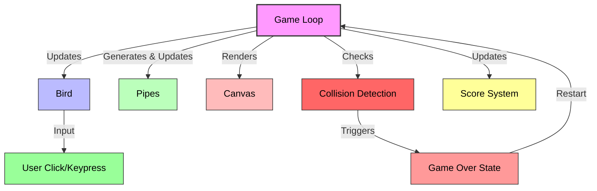

# Flappy Bird Clone Specification

This document outlines a comprehensive plan for developing a Flappy Bird clone using JavaScript. It details the structure, technology stack, game components, and development steps necessary to build a functional and engaging game.

## Overview of Flappy Bird Clone

Flappy Bird is a simple yet addictive 2D side-scrolling game where the player controls a bird that must navigate through a series of pipes by tapping or clicking to make it flap its wings and avoid collisions. The game ends if the bird hits a pipe or the ground, and the score increases with each pipe successfully passed.

## Technology Stack

- **HTML5 Canvas**: For rendering the game graphics and handling animations.
- **Vanilla JavaScript**: For game logic, physics, and user input handling. This approach keeps the project lightweight and avoids dependencies, though a framework like Phaser.js can be integrated if preferred for more complex features.
- **CSS**: For basic styling of the game container and UI elements like the score display.
- **Assets**: Simple images for the bird, pipes, background, and ground. These can be sourced or created as sprites.

## Game Components

1. **Bird**: The player-controlled entity with properties like position, velocity, and gravity. It flaps upward when the player clicks or presses a key.
2. **Pipes**: Obstacles generated at random heights with a gap for the bird to pass through. Pipes move from right to left.
3. **Ground and Sky**: Static background elements, with the ground acting as a collision boundary.
4. **Score System**: Tracks the number of pipes passed and displays the current and high score.
5. **Game States**: Includes start screen, active gameplay, and game over screen with a restart option.

## File Structure

To keep the project organized, the following directory structure is proposed:
- **index.html**: The main entry point that loads the game canvas and scripts.
- **css/style.css**: Styles for the game container and UI elements.
- **js/game.js**: Core game logic, including game loop, state management, and input handling.
- **js/bird.js**: Bird class or object with properties and methods for movement and collision.
- **js/pipe.js**: Pipe class for generating and updating pipe obstacles.
- **js/assets.js**: Handling of image and sound assets.
- **assets/**: Directory for images (bird, pipes, background) and sounds (flap, collision, point).

## Development Steps

1. **Setup Project Structure**: Create the necessary files and folders as outlined above.
2. **Initialize Canvas**: Set up the HTML5 Canvas in `index.html` and style it appropriately.
3. **Asset Preparation**: Source or create minimal graphics for the bird, pipes, and background, storing them in the `assets/` folder.
4. **Bird Mechanics**: Implement the bird's physics in `js/bird.js`, including gravity, flapping, and boundary checks.
5. **Pipe Generation**: Code the pipe logic in `js/pipe.js` to spawn pipes at intervals with random heights, ensuring a passable gap.
6. **Game Loop**: In `js/game.js`, create the main loop to update game state, render elements, and check for collisions.
7. **User Input**: Add event listeners for mouse clicks or keyboard input to control the bird's flapping.
8. **Collision Detection**: Implement logic to detect collisions between the bird and pipes or ground, triggering game over.
9. **Score Tracking**: Update and display the score as the bird passes pipes, saving the high score locally if possible.
10. **Game States**: Manage transitions between start, play, and game over states, including UI updates.
11. **Polish and Testing**: Add sound effects if assets are available, test gameplay balance (e.g., pipe spacing, bird speed), and ensure responsiveness.

## Game Architecture Diagram

To visualize the interaction between components, here's a Mermaid diagram:

This diagram illustrates how the game loop drives updates to the bird, pipes, and score, handles rendering on the canvas, and manages game state transitions through collision detection.

## Additional Considerations

- **Difficulty**: The game can start with a fixed difficulty (pipe gap and speed) and potentially increase over time or based on score.
- **Mobile Support**: Ensure touch events are handled for mobile play, adjusting canvas size for different screen dimensions.
- **Performance**: Optimize the game loop and rendering to maintain smooth gameplay, especially on lower-end devices.

This specification serves as a blueprint for the development of the Flappy Bird clone. Further details or modifications can be incorporated based on feedback or specific requirements.
